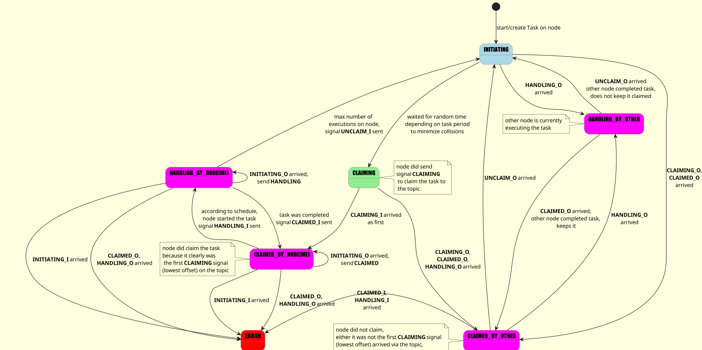

# KafkaClusteredTaskScheduler

# Contents
<!-- TOC depthFrom:1 depthTo:6 withLinks:1 updateOnSave:1 orderedList:0 -->

# Description 
A fault-tolerant scheduler that allows scheduling of periodic tasks to a single node in a clustered environment, with the sole help of Kafka messaging system. No other persistence is necessary.

KafkaNodeTaskScheduler is designed to provide exclusive execution on a single node by scheduling tasks to run on that node, ensuring that no other nodes execute the same task simultaneously. The scheduler is fault-tolerant, meaning that it can handle node failures and redistribute the failed node's tasks to other nodes in the cluster.

KafkaNodeTaskScheduler uses a single Kafka topic for messaging and coordination between the nodes. The topic serves as a centralized communication channel for the scheduler, allowing it to maintain a unified view of the state of the nodes and the tasks they are responsible for.

With KafkaNodeTaskScheduler, you can easily schedule periodic tasks to run on a single node in a clustered environment, with fault tolerance and minimal persistence requirements.

## Public Components

* Node - The entity that executes clustered Tasks. A task having a certain name will with certain constraints be executed on exactly one node, if the node is capable to do that. 
    * UniqueNodeName
    * allows the registration of a TaskDefinition. If the node is capable of executing the task, it will do claiming, if possible or necessary.
* TaskDefinition 
    * describes a certain clustered task
    * has a unique name
    * immutable
* Task
  * after the registration of a TaskDefinition a structure is created which describes the current state of the task in the current node.
* Container is a means to use the library independet of the container-architecture. General dependencies exist concerning
  * Kafka-Version
  * Java-Version

## The Statemachine

The Scheduler works by using a statemachine on each node which is triggered by various signals. These signals can arrive via a certain topic which must not have more than one partition or can be triggered node-internally.

